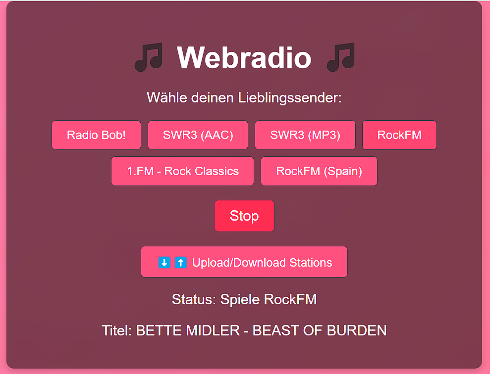
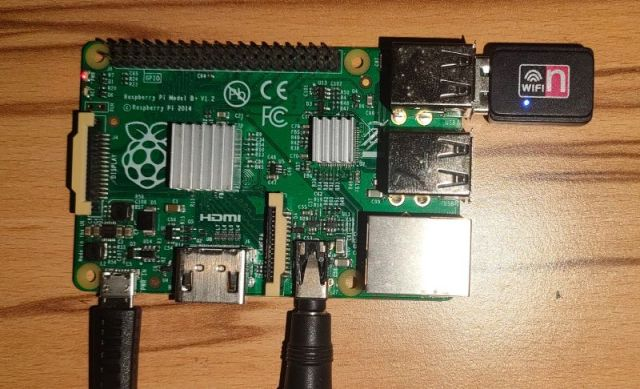

# Webradio Project


## Introduction

This project started as an experiment. I had one or two Raspberry Pi 1 devices lying around unused, and I thought it would be a great idea to repurpose them. Creating a web radio seemed like a manageable task for this somewhat outdated hardware. The twist? I decided to rely on AI to help develop it.

Using ChatGPT, I was able to complete the project in roughly half a day. While there were multiple iterations and refinements, the process felt significantly faster than traditional development. As an IT professional, I appreciated how AI handled tasks like syntax lookups, API adjustments, and even debugging. For troubleshooting, I often just pasted log outputs into the chat, which brought me remarkably close to the solution. This approach eliminated much of the drudgery typically associated with development and let me focus on the creative and technical aspects.

BTW, the logo for this project was also AI-generated. While the results from ChatGPT's suggestions (via DALL-E) were interesting, they weren't quite what I was looking for. So, I asked ChatGPT to create a tailored prompt for our locally running Flux.schnell image generator. One of the generated logos made its way into this project.

---

## Disclaimer

The streaming URLs provided in `stations.json` are publicly available and belong to their respective radio stations. This project does not host or modify the streams in any way.

---

## Screenshots

### Web Interface


### Raspberry Pi Setup


---

## Features

- Play online radio streams with `mpv`
- Simple and responsive web interface
- Upload and download station lists in JSON format
- Display the current song title (`icy-title`) in real-time
- Autostart on boot using `systemd`
- Developed with Python (Flask) and Ansible for setup automation

---

## Requirements

- Raspberry Pi OS Lite (32-bit)
- Raspberry Pi 1 (or newer)
- Python 3.7 or higher
- `mpv` for audio playback
- Flask for the web interface

---

## Installation

### 1. Prepare the Raspberry Pi

1. Use the Raspberry Pi Imager to prepare an SD card with Raspberry Pi OS Lite (32-bit).
2. During the setup, configure WiFi and set the username to `pi` and password to `pi`.
3. If using a Raspberry Pi 1, note that it does not have built-in WiFi:
   - Connect via Ethernet.
   - Alternatively, use a compatible USB WiFi adapter and configure WiFi during the imaging process.

### 2. Run Ansible Setup

1. Navigate to the `ansible` directory:
   ```bash
   cd ansible
   ```
2. Edit the `inventory.ini` file to specify the target Raspberry Pi. You can use either the IP address or the hostname (e.g., `webradio.local`). Example:
   ```ini
   [raspberry_pi]
   webradio.local ansible_user=pi ansible_password=pi
   ```
3. Execute the Ansible playbook to configure the Raspberry Pi:
   ```bash
   ansible-playbook -i inventory.ini playbook.yml
   ```
4. The playbook installs all necessary software, deploys the application, and sets up the autostart service.

### 3. Access the Web Interface

Open a web browser and navigate to:
```
http://<raspberry-pi-ip>:5000
```

---

## Usage

### Web Interface

- **Play a station**: Click on a station button.
- **Stop playback**: Click the "Stop" button.
- **Upload station list**: Use the upload button to add a new `stations.json`.
- **Download station list**: Use the download button to export the current station list.
- **View current song title**: The current song title (`icy-title`) is displayed and updated in real-time.

### Managing Stations

Stations are defined in the `stations.json` file. Example format:
```json
{
    "Radio Bob": "http://streams.radiobob.de/bob-live/mp3-192/mediaplayer",
    "Rock Antenne": "http://www.rockantenne.de/webradio/rockantenne"
}
```

---

## Project Structure

```
project/
├── ansible/              # Ansible configuration for setup
│   ├── playbook.yml      # Main Ansible playbook
│   ├── inventory.ini     # Inventory file for target hosts
│   └── roles/
│       └── webradio/
│           └── tasks/
│               └── main.yml  # Tasks for Webradio setup
├── src/                  # Source files for the Webradio application
│   ├── app.py            # Flask application
│   ├── stations.json     # List of radio stations
│   ├── templates/
│   │   └── index.html    # HTML for the web interface
│   ├── static/
│   │   └── style.css     # Styling for the web interface
│   └── webradio.service  # Systemd service file for autostart
├── doc/                  # Documentation and images
│   └── images/           # Directory for screenshots and other images
│       ├── web_interface.png
│       ├── raspberry_pi_setup.jpg
│       └── logo.png
├── LICENSE               # License file (MIT License)
└── README.md             # Project documentation
```

---

## Future Enhancements

- Support for persistent volume management
- Add more complex playback controls (e.g., pause, rewind)
- Improve error handling for unsupported streams

---

## License

This project is licensed under the MIT License. See the `LICENSE` file for details.

---

## Contributions

Contributions are welcome! Feel free to fork the repository and submit a pull request.